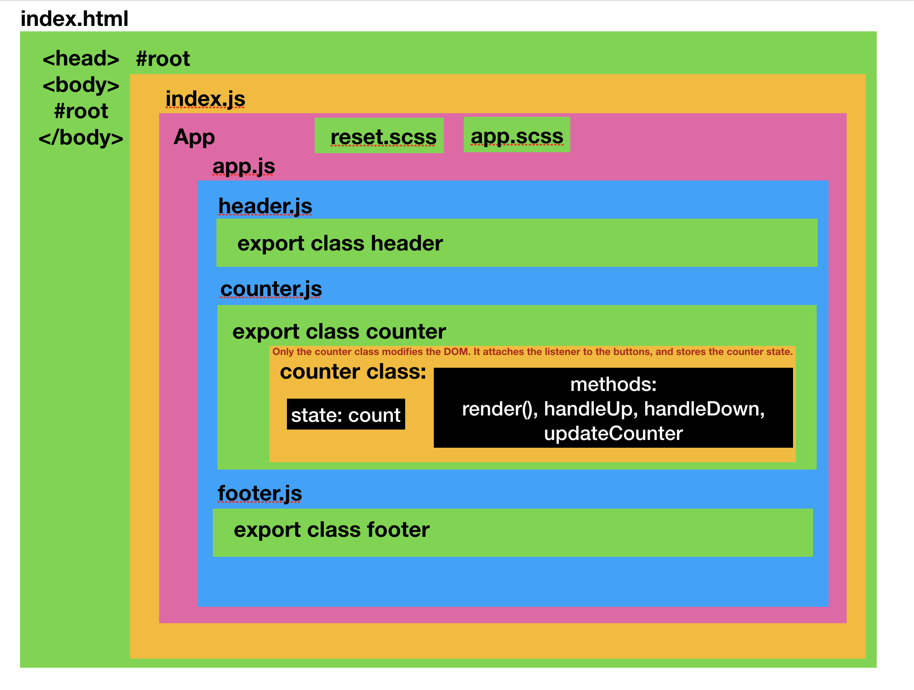

# Counter App

# Lab 27
Author: Fletcher LaRue

Date:1-29-2019

## Testing

[github repo](https://github.com/asdFletcher/27-react-testing)

##Components:

###- app.jsx
###- counter.jsx
- main app logic
  - Methods: 
    - handleUp(e) 
      - increases counter 
    - handleDown(e) 
      - decreases counter 
    - updateCounter() 
      - grabs counter from state 
    - render() 
      - renders the component
- main render method
###- footer.jsx
- static, footer
###- header.jsx
- static, header

### Icons
As raw svgs in the counter app:
- minusIcon
- plusIcon

